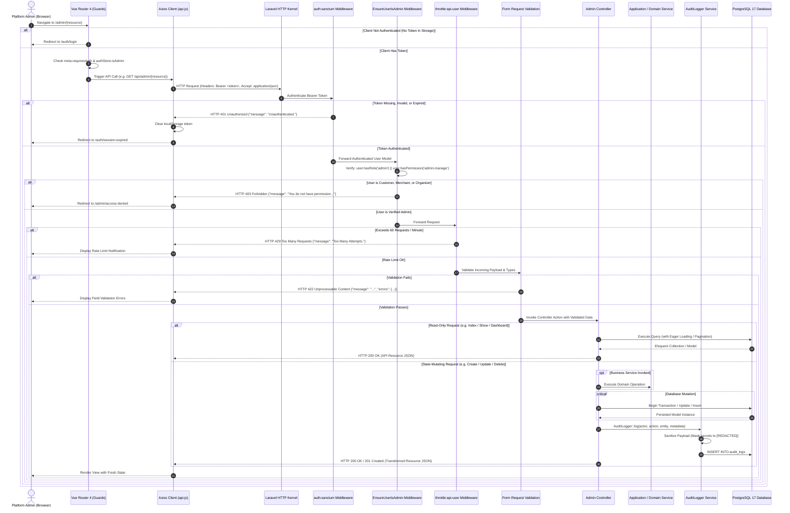

# VYBES Admin CMS — Request Flow & Sequence Traces

**Document Reference:** Architecture Subsystem Specification (Phase 6.5)  
**Parent Document:** [System Architecture](admin-cms-system-architecture.md)

---

## 1. Overview

This document specifies the end-to-end lifecycle of HTTP requests originating from the VYBES Admin CMS client through the Laravel backend, including gateway validation, middleware gates, business services, database persistence, and audit logging.

---

## 2. Diagram 3 — Comprehensive Admin Request Flow

The following diagram illustrates the complete processing sequence from user navigation to API response, including authentication failure (401), authorization failure (403), validation rejection (422), and rate limiting (429).

---

## 3. End-to-End Execution Traces

### 3.1 Trace A: Query Request — Platform Bookings Supervision
- **Route:** `GET /api/admin/bookings`
- **Controller Action:** [BookingController@index](file:///D:/Projects/vybes/backend/app/Http/Controllers/Api/Admin/BookingController.php)
1. **HTTP Parameters:** Evaluates query parameters: `booking_code`, `status`, `venue_id`, and `per_page`.
2. **Bounds Enforcement:** Limits `per_page` to `min(max((int)$perPage, 1), 100)`.
3. **Query Construction:** Instantiates `Booking::with(['user', 'venue'])` to eliminate N+1 query overhead.
4. **Ordering & Pagination:** Applies `latest('id')->paginate($perPage)`.
5. **Transformation:** Wraps collection in `BookingResource::collection()`.
6. **Side Effects:** None; no database mutations or audit logs generated.

---

### 3.2 Trace B: Mutation Request — Operator Approval State Transition
- **Route:** `POST /api/admin/approvals/merchants/{merchant}`
- **Controller Action:** [ApprovalController@updateMerchantStatus](file:///D:/Projects/vybes/backend/app/Http/Controllers/Api/Admin/ApprovalController.php)
1. **Route Model Binding:** Automatically resolves `Merchant` instance by ID via `whereNumber('merchant')`.
2. **Form Request Validation:** [ApprovalRequest.php](file:///D:/Projects/vybes/backend/app/Http/Requests/Admin/ApprovalRequest.php) validates `status in:approved,rejected,pending`.
3. **Idempotency Gate:** Checks if `$merchant->status === $validated['status']`. If identical, returns early with HTTP 200: `"Merchant status is already {status}"` without duplicate mutation or audit spam.
4. **Model Mutation:** Calls `$merchant->update(['status' => $validated['status']])`.
5. **Audit Logging:** Calls [AuditLogger.php](file:///D:/Projects/vybes/backend/app/Services/AuditLogger.php) to insert an immutable entry:
   - `action`: `merchant.approval`
   - `entity_type`: `merchant`
   - `entity_id`: `$merchant->id`
   - `metadata`: `['business_name' => ..., 'old_status' => ..., 'new_status' => ...]`
6. **Response:** Returns HTTP 200 with loaded `user` relationship.

---

### 3.3 Trace C: Financial Mutation — Manual Refund Trigger
- **Route:** `POST /api/admin/refunds`
- **Controller Action:** [RefundController@store](file:///D:/Projects/vybes/backend/app/Http/Controllers/Api/Admin/RefundController.php)
1. **Form Request Validation:** [CreateRefundRequest.php](file:///D:/Projects/vybes/backend/app/Http/Requests/Admin/CreateRefundRequest.php) validates `payment_id` (`exists:payments,id`), `amount` (numeric, min: 1), and `reason` (string, max: 100).
2. **Payment Existence:** Retrieves `Payment::findOrFail($paymentId)`.
3. **Service Delegation:** Calls `PaymentRefundService::createRefund()`.
4. **Transaction Boundary (PRD BR-010):**
   - Inside DB transaction: Executes `Payment::whereKey($id)->lockForUpdate()`, validates `$payment->status === 'paid'`, ensures refund amount does not exceed payment amount, verifies no duplicate active/succeeded refund exists, and inserts `payment_refunds` record with status `pending`.
   - Transaction COMMITS before any external network communication.
5. **External Provider Call:** `PaymentRefundService` dispatches outbound HTTP POST to Xendit Refunds API.
6. **Graceful Exception Boundary:** If `PaymentRefundService` throws a `\RuntimeException` (e.g. payment not paid, provider mismatch), `RefundController` catches it and returns HTTP 422 with the exact message, preventing 500 server crashes.
7. **Audit Record:** Emits `refund.create` audit record with sanitized financial details.
8. **Asynchronous Resolution:** Final refund state (`succeeded` or `failed`) is updated when Xendit sends an inbound webhook to `/api/webhooks/xendit`.

---

### 3.4 Trace D: Settings Mutation — Hold Duration Configuration
- **Route:** `PATCH /api/admin/settings`
- **Controller Action:** [PlatformSettingController@update](file:///D:/Projects/vybes/backend/app/Http/Controllers/Api/Admin/PlatformSettingController.php)
1. **Validation:** [UpdatePlatformSettingsRequest.php](file:///D:/Projects/vybes/backend/app/Http/Requests/Admin/UpdatePlatformSettingsRequest.php) enforces integer between 1 and 1,440 minutes.
2. **Persistence:** `PlatformSetting::set('booking_hold_duration_minutes', $val, 'integer')`.
3. **Audit Record:** Records `platform_setting.update` capturing old value and new value.
4. **Downstream Propagation:** Immediately active for subsequent calls in `BookingService`, `EventTicketPurchaseService`, and `PaymentSessionService`.
