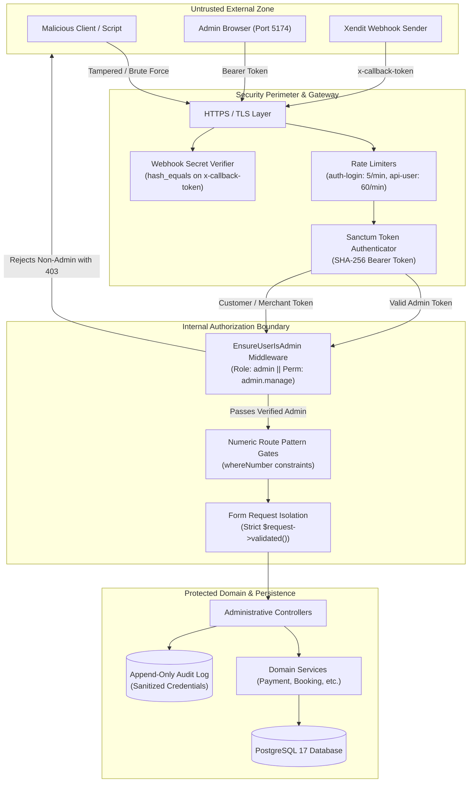

# VYBES Admin CMS — Security Boundaries & Threat Mitigation

**Document Reference:** Architecture Subsystem Specification (Phase 6.5)  
**Parent Document:** [System Architecture](admin-cms-system-architecture.md)

---

## 1. Overview

This document specifies the security boundaries, authorization invariants, authentication protocols, input validation strategies, and defense-in-depth mechanisms governing the VYBES Admin CMS subsystem.

---

## 2. Threat Model & Perimeter Boundaries



---

## 3. Authentication Boundary: Laravel Sanctum

### 3.1 Token Lifecycle & Storage
- **Mechanism:** Personal access tokens issued upon successful credentials verification at `POST /api/auth/login`.
- **Database Entity:** `personal_access_tokens` table ([2026_09_27_145624_create_personal_access_tokens_table.php](file:///D:/Projects/vybes/backend/database/migrations/2026_09_27_145624_create_personal_access_tokens_table.php)).
- **Token Hashing:** Raw tokens are delivered to the client exactly once upon generation; only SHA-256 hashes are persisted in the database.
- **Expiration Policy (SEC-H08):** Configurable via the environment variable `SANCTUM_TOKEN_EXPIRATION` (default: 43,200 minutes / 30 days). Expired tokens return `401 Unauthorized`.
- **Client Storage:** The Vue Admin client persists tokens in `localStorage` under the key `vybes_auth_token`. When an HTTP 401 response is intercepted, the token is automatically wiped from `localStorage`, clearing user context.

---

## 4. Administrative Authorization Model

### 4.1 Access Rule
Every route within `/api/admin/*` is evaluated by [EnsureUserIsAdmin.php](file:///D:/Projects/vybes/backend/app/Http/Middleware/EnsureUserIsAdmin.php). Access is granted if and only if:
$$\text{Authorized} \iff \text{User.hasRole('admin')} \lor \text{User.hasPermission('admin.manage')}$$

### 4.2 Behavior on Non-Admin Roles
Users holding valid credentials and authenticated Sanctum tokens but assigned to other roles (`customer`, `merchant`, `organizer`) are immediately rejected:
- **HTTP Status:** `403 Forbidden`
- **Response Payload:** `{"message": "You do not have permission to access the VYBES Admin CMS."}`
- **Client Behavior:** Caught by Axios interceptor; router navigates to `/admin/access-denied`.

---

## 5. Defense Against Insecure Direct Object References (IDOR)

### 5.1 Route Parameter Constraining
Every route model binding in the admin group enforces numeric pattern validation using `whereNumber()`:
```php
Route::get('/users/{user}', ...)->whereNumber('user');
Route::get('/bookings/{booking}', ...)->whereNumber('booking');
Route::get('/categories/{category}', ...)->whereNumber('category');
Route::get('/refunds/{refund}', ...)->whereNumber('refund');
Route::get('/venues/{venue}', ...)->whereNumber('venue');
```
Any request containing non-numeric path segments (such as SQL injection syntax, directory traversal attempts, or alphanumeric tampering) fails route matching and receives an immediate `404 Not Found` before invoking controller logic.

### 5.2 Global vs Tenant Supervision
Unlike customer or organizer endpoints that restrict access using user ownership scopes (e.g. `$user->id === $event->organizer_id`), Admin CMS endpoints intentionally execute with platform-wide supervision authority. Protection against IDOR in the Admin domain relies on the strictness of the `admin` middleware gate.

---

## 6. Mass Assignment & Input Security

### 6.1 Form Request Isolation
Controllers are prohibited from using `$request->all()`. Every mutating operation consumes strictly validated data via dedicated Form Requests:
- **`UpdateUserRequest`:** Restricts updatable fields to `name`, `email`, and `role_id`. Injection of `password`, `is_active`, `status`, or timestamp overrides is filtered out.
- **`ApprovalRequest`:** Enforces `status in:approved,rejected,pending`.
- **`CreateRefundRequest`:** Restricts payload to `payment_id`, `amount`, and `reason`.
- **`StoreCategoryRequest` & `UpdateCategoryRequest`:** Restricts fields to category metadata; auto-generates slug safely.
- **`UpdatePlatformSettingsRequest`:** Enforces integer bounds (1 to 1,440) for booking hold duration.

---

## 7. Audit Log Immutability & Credential Sanitization

### 7.1 Immutability Enforcement
The audit trail is protected against tampering:
- **API Read-Only:** The route `/api/admin/audit` supports only the `GET` method. Any `POST`, `PUT`, `PATCH`, or `DELETE` request is rejected with `405 Method Not Allowed` or `404 Not Found`.
- **Model-Level Exceptions:** In [AuditLog.php](file:///D:/Projects/vybes/backend/app/Models/AuditLog.php), event listeners throw `\LogicException`:
  ```php
  static::updating(fn() => throw new LogicException('AuditLog records are append-only and cannot be updated.'));
  static::deleting(fn() => throw new LogicException('AuditLog records are immutable and cannot be deleted.'));
  ```

### 7.2 Automatic Credential Sanitization
[AuditLogger.php](file:///D:/Projects/vybes/backend/app/Services/AuditLogger.php) inspects all metadata structures recursively and replaces sensitive keys with `'[REDACTED]'`:
- `password`, `password_confirmation`
- `token`, `access_token`, `bearer_token`
- `secret`, `api_key`
- `x-callback-token`
- `credit_card`, `cvv`

---

## 8. Rate Limiting & Abuse Prevention

### 8.1 Configured Rate Limiters
Configured in [bootstrap/app.php](file:///D:/Projects/vybes/backend/bootstrap/app.php) and route definitions:

| Limiter Name | Rate Limit | Target Key | Applied Routes |
|---|---|---|---|
| `throttle:api-user` | 60 requests / minute | Authenticated User ID (fallback to IP) | All `/api/admin/*` endpoints |
| `throttle:auth-login` | 5 requests / minute | IP address + email | `POST /api/auth/login` |
| `throttle:auth-register` | 5 requests / minute | IP address | `POST /api/auth/register` |
| `throttle:api-check-in` | 30 requests / minute | User ID | `POST /api/check-in` |

---

## 9. External Provider Security: Xendit Webhooks

- Inbound endpoint `POST /api/webhooks/xendit` does not use Sanctum (as requests originate from Xendit servers).
- Inbound validation requires the `x-callback-token` header.
- Token comparison is performed using PHP's timing-safe `hash_equals()` against `config('services.xendit.webhook_token')` to eliminate timing attack vulnerabilities.
- Malformed payloads (missing `event` string or non-array `data`) are rejected with `422 Unprocessable Content`. Unknown events with valid structures are acknowledged with `200 OK` without triggering state mutations.
