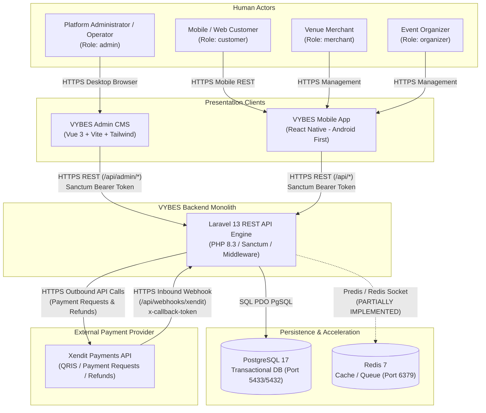
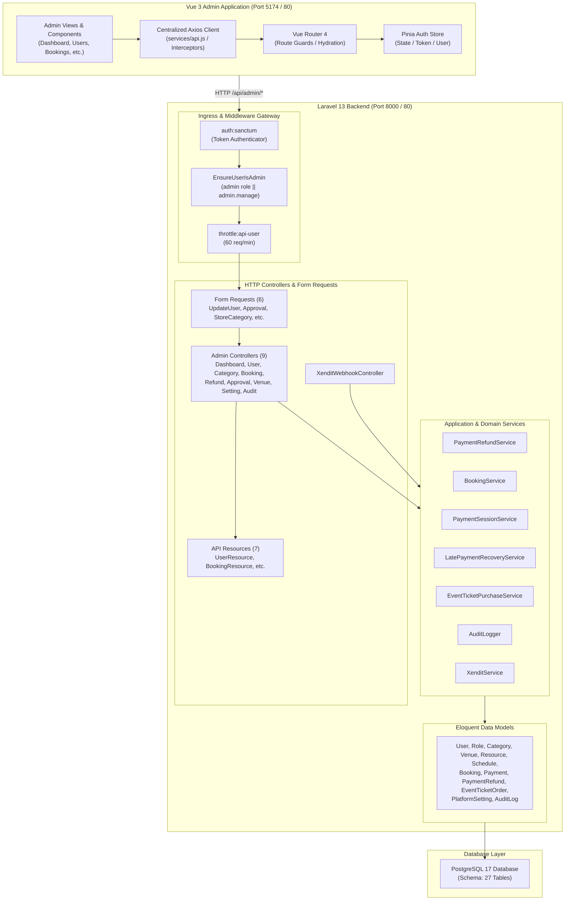
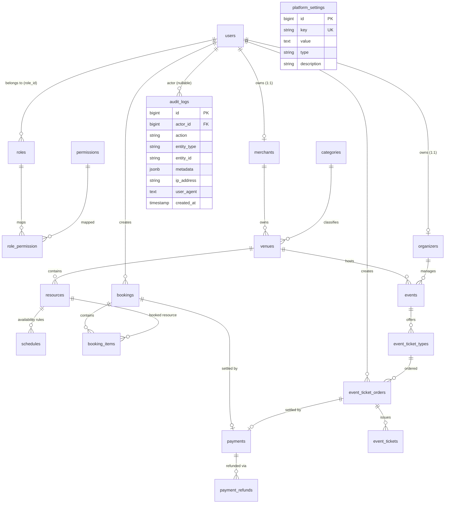
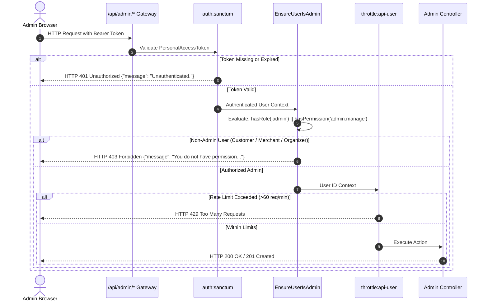
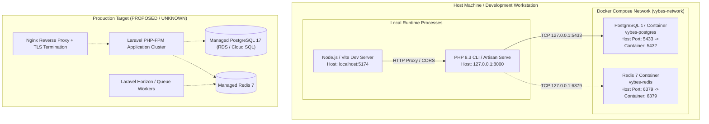

# VYBES Admin CMS — System Architecture

**Baseline Document:** PRD VYBES v1.2.4 (06 Oktober 2026)  
**System Layer:** Subsystem Platform Administrator & Operations Console  
**Document Status:** Architecture Definition & Verification Baseline (Phase 6.5)  
**Classification Guide:**
- `IMPLEMENTED`: Verified in repository source code.
- `PARTIALLY IMPLEMENTED`: Foundation exists; full operational lifecycle incomplete.
- `PLANNED`: Documented in PRD or system intention; schema or code absent.
- `PROPOSED`: Architectural recommendation awaiting implementation.
- `UNKNOWN`: Cannot be confirmed from the active repository files.

---

## Related Architecture Documents
- [Admin Request Flow & Sequence Traces](admin-cms-request-flow.md)
- [Security Boundaries & Threat Mitigation](admin-cms-security-boundaries.md)
- [Architecture Decision Records (ADRs)](admin-cms-architecture-decisions.md)
- [Architecture Gap Analysis](admin-cms-architecture-gaps.md)

---

## 1. Purpose and Scope

The VYBES Admin CMS subsystem serves as the central administrative and operational control plane for the VYBES platform. Its primary role is to enforce platform governance, oversee multi-category venues and event operations, manage transactional lifecycles (bookings, tickets, payments, refunds), inspect operational metrics, and maintain platform configurations and auditability.

This architecture definition establishes the definitive technical boundaries across presentation, API, application/domain, and persistence layers prior to the finalization of Phase 7 (Backend Contract Freeze) and the subsequent Figma-to-Vue implementation.

---

## 2. Architecture Principles

1. **Evidence Over Assumptions:** Only components, database tables, models, and endpoints verified in the repository are represented as existing.
2. **Single Transactional Source of Truth:** PostgreSQL 17 is the sole authoritative transactional persistence store. Redis 7 is designated as a volatile accelerator and queue broker, not an authoritative ledger.
3. **Strict Separation of Concerns:** The presentation layer ([admin/](file:///D:/Projects/vybes/admin)) interacts with business logic exclusively through stateless REST APIs ([routes/api.php](file:///D:/Projects/vybes/backend/routes/api.php)). Business rules must not be synthesized or compensated for within the Vue frontend.
4. **Defense in Depth & Server-Side Enforcement:** Route guards in Vue are purely for UX guidance. Security, RBAC, and data integrity gates are strictly enforced at the Laravel API middleware and service layers.
5. **Decoupled Financial Operations:** External payment gateway communications (e.g., Xendit HTTP API) must execute outside database transactional boundaries to eliminate connection starvation and deadlocks (PRD BR-010).

---

## 3. System Context

The Admin CMS interfaces platform operators with backend services and external payment infrastructure.



---

## 4. Application / Container Architecture

The VYBES core system is organized as a **Modular Monolith** containing isolated domain service modules behind a unified HTTP routing and middleware gateway.



---

## 5. Frontend Architecture

### 5.1 Technology Stack & Foundations
- **Framework:** Vue 3 Composition API (`<script setup>`)
- **Build Tool:** Vite 8.3 / Rolldown bundler
- **State Management:** Pinia 3
- **Routing:** Vue Router 4 (HTML5 history mode)
- **HTTP Client:** Axios with custom request/response interceptors
- **Styling:** Tailwind CSS v4 using semantic design tokens

### 5.2 Application Lifecycle & Authentication Hydration
1. **Application Bootstrap:** [admin/src/main.js](file:///D:/Projects/vybes/admin/src/main.js) initializes Pinia, registers Vue Router, and mounts the root component.
2. **State Hydration:** When a page load occurs with an existing token in `localStorage`, [admin/src/router/guards.js](file:///D:/Projects/vybes/admin/src/router/guards.js) intercepts navigation and executes `authStore.fetchCurrentUser()` (`GET /api/auth/me`).
3. **Route Protection:** Routes configured with `meta.requiresAuth` verify:
   - User is authenticated (`token` + `user` state present).
   - User has admin clearance (`userRole === 'admin' || userPermissions.includes('admin.manage')`).
   - If unauthorized, users are routed to `/auth/login` (401) or `/admin/access-denied` (403).

### 5.3 API Service Layer
All network communications pass through [admin/src/services/api.js](file:///D:/Projects/vybes/admin/src/services/api.js), enforcing:
- Injection of `Authorization: Bearer <token>` on all outbound requests.
- Normalization of errors into typed structures (`validation`, `unauthorized`, `forbidden`, `not_found`, `server`, `network`).
- Centralized detection of HTTP 401: automatically clears `localStorage` and routes to `/auth/session-expired`.

---

## 6. Backend Architecture

### 6.1 Routing & Route Groups
All admin endpoints reside in [backend/routes/api.php](file:///D:/Projects/vybes/backend/routes/api.php) under the `/admin` prefix and are enclosed in a middleware group:
```php
Route::prefix('admin')
    ->middleware([
        'auth:sanctum',
        'admin',
        'throttle:api-user',
    ])
    ->group(...)
```

### 6.2 Administrative Controller Inventory & Responsibilities
1. [DashboardController.php](file:///D:/Projects/vybes/backend/app/Http/Controllers/Api/Admin/DashboardController.php): Calculates real-time aggregate statistics from PostgreSQL tables.
2. [UserController.php](file:///D:/Projects/vybes/backend/app/Http/Controllers/Api/Admin/UserController.php): Provides paginated user listings and executes audited role assignments.
3. [ApprovalController.php](file:///D:/Projects/vybes/backend/app/Http/Controllers/Api/Admin/ApprovalController.php): Manages merchant and organizer onboarding state transitions (`pending`, `approved`, `rejected`) with idempotency guards.
4. [CategoryController.php](file:///D:/Projects/vybes/backend/app/Http/Controllers/Api/Admin/CategoryController.php): Full CRUD for platform venue classifications with slug generation and deletion protection.
5. [BookingController.php](file:///D:/Projects/vybes/backend/app/Http/Controllers/Api/Admin/BookingController.php): Read-only supervision of venue reservation orders.
6. [RefundController.php](file:///D:/Projects/vybes/backend/app/Http/Controllers/Api/Admin/RefundController.php): Supervises refund transactions and triggers manual refunds via `PaymentRefundService`.
7. [VenueController.php](file:///D:/Projects/vybes/backend/app/Http/Controllers/Api/Admin/VenueController.php): Read-only platform-wide supervision of merchant venues and resources.
8. [PlatformSettingController.php](file:///D:/Projects/vybes/backend/app/Http/Controllers/Api/Admin/PlatformSettingController.php): Manages dynamic platform settings (e.g., `booking_hold_duration_minutes`).
9. [AuditLogController.php](file:///D:/Projects/vybes/backend/app/Http/Controllers/Api/Admin/AuditLogController.php): Read-only administrative viewer for append-only audit trail records.

---

## 7. Data Architecture

### 7.1 Verified Entity Relationship Overview
The database schema consists of **27 migrated tables**. The authoritative entities governing the Admin CMS include:



### 7.2 Database Invariants & Structural Findings
- **Availabilities vs Schedules:** The PRD mentions an `availabilities` entity. In the actual database migrations, resource time slots are persisted in the `schedules` table ([2026_09_27_151631_create_schedules_table.php](file:///D:/Projects/vybes/backend/database/migrations/2026_09_27_151631_create_schedules_table.php)).
- **Role Permission Pivot:** The pivot table is named `role_permission` (singular), not `role_permissions`.
- **Payment Separation (PRD BR-015):** The `payments` table retains status `paid` permanently; refund states are tracked strictly in `payment_refunds`.
- **Audit Immutability:** The `audit_logs` table has no `updated_at` column and enforces model-level exception throwing on update or delete attempts.

---

## 8. Authentication and Authorization Architecture

### 8.1 Authentication Lifecycle (Sanctum Tokens)
- State: Stateless API authentication via `personal_access_tokens` table.
- Default Expiration: Configurable via `SANCTUM_TOKEN_EXPIRATION` (default: 43,200 minutes / 30 days).
- Tokens are hashed using SHA-256 before database insertion.

### 8.2 Authorization Rules
Access to `/api/admin/*` is controlled by [EnsureUserIsAdmin.php](file:///D:/Projects/vybes/backend/app/Http/Middleware/EnsureUserIsAdmin.php):
```php
if (!$user->hasRole('admin') && !$user->hasPermission('admin.manage')) {
    return response()->json([
        'message' => 'You do not have permission to access the VYBES Admin CMS.',
    ], 403);
}
```



---

## 9. Payment and Refund Integration Architecture

The payment architecture utilizes **Xendit** as the external payment provider. In accordance with PRD BR-010, outbound HTTP requests to external provider APIs are strictly decoupled from internal database transactions.

```mermaid
sequenceDiagram
    autonumber
    actor Admin as Platform Admin
    participant Ctrl as RefundController@store
    participant Service as PaymentRefundService
    participant DB as PostgreSQL
    participant Xendit as Xendit HTTP API
    participant Webhook as XenditWebhookController

    Admin->>Ctrl: POST /api/admin/refunds {payment_id, amount, reason}
    Ctrl->>Service: createRefund(payment, amount, reason)
    
    critical Database Transaction & Row Lock
        Service->>DB: SELECT * FROM payments WHERE id = ? FOR UPDATE
        Service->>DB: Check status == 'paid' & verify amount <= payment.amount
        Service->>DB: Check existing pending/succeeded refund (Idempotency)
        Service->>DB: INSERT INTO payment_refunds (status='pending', reference_id)
        DB-->>Service: Commit Transaction
    end

    opt External Call (Executed OUTSIDE DB Transaction - PRD BR-010)
        Service->>Xendit: POST /v2/refunds (reference_id, amount, reason)
        alt Provider Error / Network Failure
            Xendit-->>Service: Exception / Rejection
            Note over Service: Exception caught; local refund remains 'pending' for retry
        else Provider Accepted
            Xendit-->>Service: HTTP 200 {provider_refund_id, status='PENDING'}
            Service->>DB: UPDATE payment_refunds SET provider_refund_id = ?
        end
    end

    Ctrl-->>Admin: HTTP 201 Created (PaymentRefundResource)

    Note over Webhook: Asynchronous Reconciliation
    Xendit->>Webhook: POST /api/webhooks/xendit (event: refund.succeeded)
    Webhook->>Webhook: Verify x-callback-token (hash_equals)
    Webhook->>DB: UPDATE payment_refunds SET status='succeeded', succeeded_at=now()
    Webhook-->>Xendit: HTTP 200 OK
```

---

## 10. Audit Logging Architecture

Administrative activity is captured in the `audit_logs` table via [AuditLogger.php](file:///D:/Projects/vybes/backend/app/Services/AuditLogger.php).

### Key Architectural Invariants
1. **Append-Only Immutability:** [AuditLog.php](file:///D:/Projects/vybes/backend/app/Models/AuditLog.php) hooks into Eloquent's `updating` and `deleting` events to throw `\LogicException`. Direct mutation or deletion via the API or model is prohibited.
2. **Credential Sanitization:** Keys matching `password`, `token`, `secret`, `api_key`, `x-callback-token`, `credit_card`, and `cvv` are automatically masked to `'[REDACTED]'`.
3. **Traceability:** Captures actor ID, action name, target entity type, entity ID, client IP address, User-Agent, and `before`/`after` JSON payloads.

---

## 11. Configuration and Dynamic Settings

Platform runtime settings are centralized in the `platform_settings` table.
- **Hold Duration Unification (PRD BR-003):** Booking and ticket holds retrieve their expiration duration dynamically via `PlatformSetting::get('booking_hold_duration_minutes', 15)`.
- **Verified Consumers:**
  - [BookingService.php](file:///D:/Projects/vybes/backend/app/Services/BookingService.php#L150)
  - [EventTicketPurchaseService.php](file:///D:/Projects/vybes/backend/app/Services/EventTicketPurchaseService.php#L92)
  - [PaymentSessionService.php](file:///D:/Projects/vybes/backend/app/Services/PaymentSessionService.php#L52)
- **Validation:** Bounded by `UpdatePlatformSettingsRequest` (1 to 1,440 minutes).

---

## 12. Deployment Architecture

The deployment topology verified in the repository corresponds to a reproducible **Docker Development Environment**. Production ingress and clustering components are currently **PROPOSED / UNVERIFIED**.



### Verified Infrastructure Components
- `postgres:17` via Docker Compose (Port 5433 mapped to avoid native PostgreSQL conflicts).
- `redis:7-alpine` via Docker Compose (Port 6379).
- Single-node execution; clustering, load balancers, and production Dockerfiles are **UNKNOWN / NOT YET IMPLEMENTED**.

---

## 13. Trust Boundaries

1. **Client / Gateway Boundary:** The Vue Admin application executes in an untrusted browser environment. Token storage in `localStorage` is vulnerable to XSS if client-side dependencies are compromised. The backend treats all incoming headers and payloads as untrusted.
2. **Administrative Access Boundary:** Any authenticated user lacking `admin` role or `admin.manage` permission is immediately halted at the middleware perimeter with HTTP 403.
3. **External Provider Boundary:** Xendit inbound webhooks do not use Sanctum; their integrity is validated using cryptographic comparison (`hash_equals`) of the `x-callback-token` header against local environment secrets.
4. **Database Mutation Boundary:** Direct client mutation of database entities is blocked; all mutations pass through Form Request validation, authorization checks, and transaction boundaries.

---

## 14. Current Limitations & Technical Constraints

1. **User Account Status:** The `users` table lacks an account lifecycle/status column (`status`). User account suspension cannot be implemented safely without product decisions regarding token revocation and active ticket/booking cancellation.
2. **Review Domain (FR-016):** The database lacks a `reviews` schema; reviews management in Admin CMS is strictly planned and cannot be bound to backend CRUD.
3. **Banner Media (PRD Section 5.2):** No `banners` table exists in PostgreSQL migrations.
4. **Asynchronous Processing:** Background jobs (`ExpireBookingHolds`, `ExpireEventTicketHolds`) run synchronously or via console scheduler; queue worker infrastructure (e.g. Redis queues, Horizon) is configured but not yet leveraged in production.

---

## 15. Relationship to Future Phases

- **Phase 6.5 (Current):** Documents, maps, and validates the existing architecture without modifying application business logic or UI code.
- **Phase 7 (Next):** Enforces backend contract stability, refines state transitions, verifies test coverage, and executes **Contract Freeze**.
- **Phase 8 (Future):** Implements the finalized Admin Figma design into Vue components against the frozen, verified backend API contracts.
